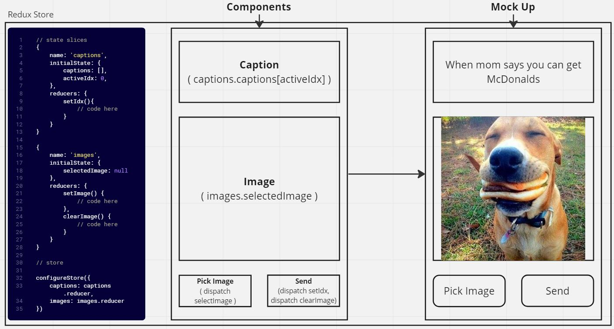

# Definitely Not What Do You Meme

Do you have tons of funny pictures or super niche memes that you never get a chance to share with your friends? Well do I have a game for you!

## Problem Domain

A mobile-friendly spin on the game "What do you meme?". Users a provided a caption and they must find an image from their camera roll that best fits the caption. Once the user presses `send`, a new caption is generated and a new round starts. 

Ideally, this game would be played with friends and everyone would vote on which image is the best / funniest but as of right now it's just a proof of concept so there is no voting.

## User Stories

- The user should be able to browse their phone's local files &/o their files from the cloud to choose an image

- The user should see a new caption / prompt upon sending the image

## UML

## Built With / Learning Focus
- React Native
- Redux / Redux Toolkit

## Getting Started
If running this app locally, you will first need to install an iOS or Android emulator and ensure that the emulator runs.

Once the emulator is installed and working, run the command `npm i` to install all of the required dependencies for this app.

Run `npm start` from the command line and follow the on screen prompts to open the app in the emulator of your choosing.